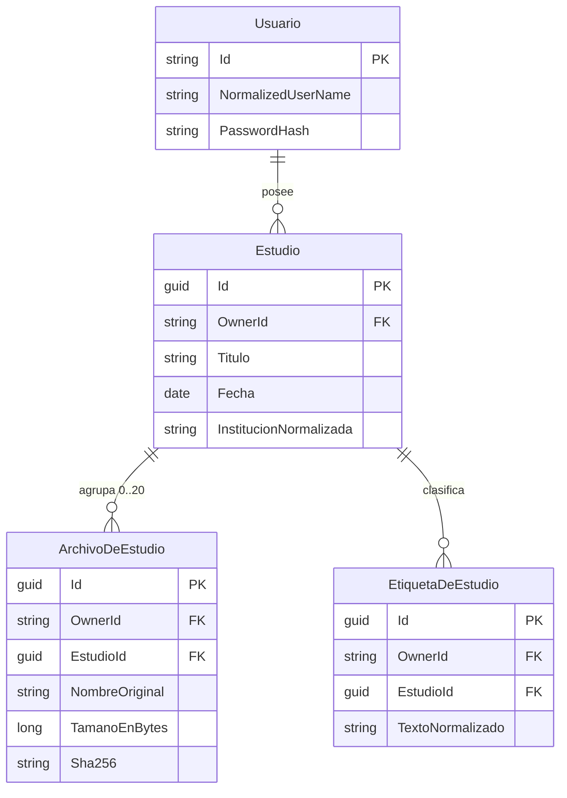

# Fase 1 — Modelo de Datos

**Feature**: MVP Mi Archivo Médico · **Fecha**: 2026-08-19 · **Plan**: [plan.md](./plan.md)

Modelo de persistencia derivado de las Entidades Clave de [spec.md](./spec.md). Describe **qué** se
guarda y **qué invariantes** lo protegen, no cómo se declara en el mapeo.

## Convenciones que atraviesan el modelo

- **`IPropiedadDeUsuario`**: interfaz marcadora con `OwnerId`. Toda entidad que la implemente recibe
  automáticamente el filtro global por propietario. **Implementarla es el único requisito para que una
  entidad médica nueva quede aislada.** (RNF-53)
- **Columnas normalizadas**: cada campo de texto buscable se persiste dos veces, en su forma original y
  en su forma normalizada e indexada. La normalizada la calcula la interceptación de `SaveChanges` con
  `NormalizadorDeTexto.Normalizar`; nunca se escribe a mano. (RNF-55)
- **Fechas**: la fecha del estudio es una fecha de calendario sin hora. Las marcas de tiempo del
  sistema son `DateTimeOffset` y se persisten con conversor a ticks UTC, porque SQLite no las compara
  en un ordenamiento. Todas se obtienen del `TimeProvider` inyectado.
- **Eliminación**: física. No hay marca de borrado ni estado "eliminado" en ninguna entidad. (FR-044)

## Entidades

### Equivalencia de nombres con la especificación

`spec.md` nombra las entidades en lenguaje de negocio y este documento usa el nombre con el que se
persisten. Son las mismas:

| Entidad en `spec.md` | Entidad en el modelo |
|---|---|
| Cuenta | `Usuario` |
| Estudio | `Estudio` |
| Archivo asociado | `ArchivoDeEstudio` |
| Etiqueta | `EtiquetaDeEstudio` |
| Registro de intentos de inicio de sesión | `IntentoDeInicioDeSesion` |

Dos entidades del spec **no** tienen tabla, y es deliberado: **Sesión** la administra el manejador de
autenticación de la plataforma y su duración se configura, no se persiste; y **Cupo de almacenamiento**
es un valor calculado como la suma de `TamanoEnBytes` de todos los archivos, contrastado contra un
límite de configuración. Materializar cualquiera de las dos crearía un dato que puede quedar
desincronizado de la realidad.

### Usuario

Identidad de un integrante del grupo familiar. Es la entidad de Identity, sin datos médicos.

| Campo | Tipo | Reglas |
|---|---|---|
| `Id` | texto | Clave. Es el valor que estampa `OwnerId` en el resto del modelo. |
| `UserName`, `NormalizedUserName` | texto | Únicos. El normalizado es el que usa el control de intentos. |
| `Email`, `NormalizedEmail` | texto | Provisto por el alta administrativa. |
| `PasswordHash` | texto | PBKDF2-HMAC-SHA256, formato Identity V3, ≥ 100.000 iteraciones. (RNF-03, AC-76) |

**No implementa `IPropiedadDeUsuario`**: es la raíz de la propiedad, no un dato poseído.

**Reglas de ciclo de vida**: el alta es administrativa y externa a la aplicación, a partir de
configuración, y se aplica en cada arranque omitiendo las que ya existen. El arranque rechaza el alta
que exceda 5 cuentas activas. No hay ruta de registro, de cambio ni de recuperación de contraseña.
(RNF-54, RNF-56, AC-50, AC-62)

### Estudio

Unidad de organización del repositorio y única entidad que el usuario crea directamente.

| Campo | Tipo | Reglas |
|---|---|---|
| `Id` | GUID | Clave. Nunca se expone un identificador secuencial. |
| `OwnerId` | texto | Estampado por la interceptación de `SaveChanges`. Nunca se asigna en un controlador. |
| `Titulo` | texto | Obligatorio, no vacío. (RF-34, AC-10) |
| `TituloNormalizado` | texto indexado | Calculado. Buscable. (RF-16, AC-71) |
| `Fecha` | fecha sin hora | Obligatoria, existente en el calendario y no posterior al día en curso. (RF-35, RF-37, AC-11, AC-91) |
| `Profesional` | texto | Opcional, texto libre. (RF-29) |
| `ProfesionalNormalizado` | texto indexado | Calculado. Buscable. (AC-73) |
| `Institucion` | texto | Opcional, texto libre. (RF-30) |
| `InstitucionNormalizada` | texto indexado | Calculada. Buscable y base de la lista del filtro. (AC-29, AC-92) |
| `Descripcion` | texto | Opcional, texto libre. (RF-31) |
| `DescripcionNormalizada` | texto indexado | Calculada. Buscable. (AC-72) |
| `CreadoEn` | marca de tiempo | Del `TimeProvider`. |

**Relaciones**: 0..20 `ArchivoDeEstudio`, 0..N `EtiquetaDeEstudio`, ambas en cascada al eliminar.

**Invariantes**: un estudio pertenece a exactamente una cuenta y **nunca cambia de propietario**: no
existe ninguna ruta ni acción que lo permita (RNF-57, AC-63). Un estudio sin archivos es un estado
válido y navegable.

### ArchivoDeEstudio

Documento adjunto a un estudio. La fila describe el archivo; el contenido vive cifrado en disco.

| Campo | Tipo | Reglas |
|---|---|---|
| `Id` | GUID | Clave, y también el nombre físico en el almacenamiento. (RNF-22, AC-65) |
| `OwnerId` | texto | Estampado por la interceptación. Heredado del estudio. |
| `EstudioId` | GUID | Obligatorio. Máximo 20 archivos por estudio. (RNF-61, AC-70) |
| `NombreOriginal` | texto | Sanitizado antes de guardarse: sin separadores de ruta, sin caracteres de control, sin secuencias `..`, truncado a 255, conservando la extensión. Se escapa al mostrarlo. (RNF-23, AC-66) |
| `TipoDeContenido` | texto | Uno de los cuatro formatos admitidos, coherente con la firma binaria. (RF-08, RNF-15) |
| `TamanoEnBytes` | entero | > 0 y ≤ 50 MB. Alimenta el cálculo del cupo. (RNF-14, RNF-52, RNF-64) |
| `Sha256` | texto | Del contenido en claro, calculado antes de cifrar. (RNF-19, AC-25, AC-77) |
| `CargadoEn` | marca de tiempo | Del `TimeProvider`. |

**Invariantes**: el nombre físico **no** deriva del nombre original. El contenido se guarda cifrado con
AES-256, con el vector de inicialización en los primeros 16 bytes. Una fila solo existe si el archivo
superó la validación completa: los rechazados nunca llegan al almacenamiento definitivo ni a la base
(RNF-21, AC-27). Al eliminar el estudio se borran la fila y el contenido físico (FR-044, AC-102).

### EtiquetaDeEstudio

Término libre asociado a un estudio para clasificarlo y encontrarlo.

| Campo | Tipo | Reglas |
|---|---|---|
| `Id` | GUID | Clave. |
| `OwnerId` | texto | Estampado por la interceptación. |
| `EstudioId` | GUID | Obligatorio. |
| `Texto` | texto | Texto libre, tal como lo escribió el usuario. (RF-32, AC-89) |
| `TextoNormalizado` | texto indexado | Calculado. Buscable. (AC-30, AC-46) |

**Decisión de modelado**: la etiqueta es una fila por estudio, **no** una entidad compartida con tabla
de unión. No hay ningún requerimiento de reutilizar etiquetas entre estudios, de autocompletar ni de
listarlas, y una entidad compartida agregaría una relación y una regla de deduplicación que nadie pidió
(Principio V).

### IntentoDeInicioDeSesion

Acumulado que sostiene el bloqueo temporal por intentos fallidos.

| Campo | Tipo | Reglas |
|---|---|---|
| `Id` | GUID | Clave. |
| `NombreDeUsuarioNormalizado` | texto indexado | El nombre **ingresado**, exista o no una cuenta con él. (RNF-65, AC-98) |
| `Fallos` | entero | Se reinicia a cero ante un ingreso exitoso. (RNF-60, AC-87) |
| `UltimoFalloEn` | marca de tiempo | Del `TimeProvider`. Base de las ventanas de 15 minutos. (AC-69, AC-86) |

**No implementa `IPropiedadDeUsuario`**: no es un dato médico y debe poder consultarse **sin sesión**,
que es justamente cuando se evalúa. Someterla al filtro global la volvería invisible en el único
momento en que hace falta.

**Regla de depuración**: al no estar acotada a las cuentas existentes, un atacante podría hacerla
crecer probando nombres inventados. Las entradas cuya ventana ya venció se eliminan.

## Estado que no vive en la base

**Criterio de búsqueda** (término, rango de fechas, institución, página): vive en el estado de sesión
del servidor, no en la base ni en la dirección. Es efímero, por usuario y por sesión. Motivo en
[research.md](./research.md) §3.

**Token de acceso a archivo**: no se persiste. Es un valor firmado con vencimiento propio, verificado
al recibirlo. Motivo en [research.md](./research.md) §4.

## Diagrama de relaciones

`IntentoDeInicioDeSesion` queda fuera del diagrama a propósito: no tiene relación con ninguna otra
entidad y se consulta sin sesión.
